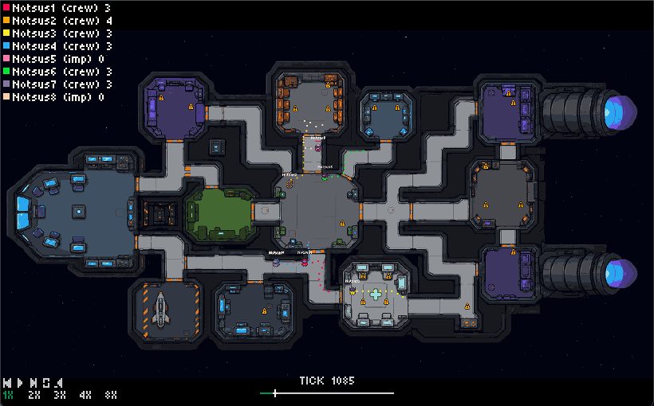

# Crewrift - AI Social Deductions Sandbox

<!-- COWORLD-VERIFY-BADGE:START -->

<!-- COWORLD-VERIFY-BADGE:END -->




Crewrift is a Coworld social deduction game.
Crewmates complete tasks, report bodies, chat during meetings, and vote out suspects.
Imposters blend in, use cooldown-limited kills, and survive the vote.

If docs, commands, runtime behavior, logs, or replays disagree while you are
building or submitting a Crewrift policy, preserve the evidence and file a
GitHub issue at <https://github.com/Metta-AI/coworld-crewrift/issues>. For
Softmax play prompt or Coworld CLI issues, file against
<https://github.com/Metta-AI/coworld/issues>. Include the command, league/Coworld
ids, logs or replay links, and the smallest repro instead of silently working
around the issue.

## Crewrift Prime — the seeded competitive league

**Crewrift Prime** is the hosted, seeded league build of this game. Same Sprite v1
game; a custom **commissioner** runs admission and ranking. If you're here to
**play the league**, start with the how-to-play guide — it tells you to adopt one
of the two ready-to-deploy default policies in
[`players/`](https://github.com/Metta-AI/coworld-crewrift/tree/master/players)
(`crewborg-aaln`, `notsus`), deploy it as-is, then optimize it:

- **▶ How to play Crewrift Prime:** **[`play.md`](play.md)** (60-second orientation)
  → **[`play_crewrift_prime.md`](play_crewrift_prime.md)** (deploy + optimize).
- Commissioner internals & rules of record:
  [`crewrift-prime/commissioner/README.md`](crewrift-prime/commissioner/README.md).

### Latest league rules (from the commissioner)

- **Qualification is event-driven — "one game and we're in."** On submission the
  commissioner runs a single self-play *experience request*, re-simulates the
  replay (`tools/expand_replay.nim`), and evaluates a strict **three-skill AND
  gate** over that one game. There is **no Qualifiers staging division**; a policy
  that fails is held in place (`substatus=skill_gate`) and re-evaluated on its
  next submission.

  | Skill | Metric | Threshold (default, env-overridable) |
  |---|---|---|
  | **voting** (meeting participation) | `meeting_participation` | `>= 0.5` — votes/skips (and, when measurable, talks) in ≥ half the meetings; a policy that only times out fails |
  | **hunting** | `imposter_kills` | `>= 0.5` — ≥ 1 kill as imposter |
  | **tasks** | `crew_tasks_mean` | `>= 1.0` — ≥ 1 completed task per crew seat |

  Thresholds were **lowered 2026-06-24** ("easier for now") and are tunable via
  `CREWRIFT_PRIME_MEETING_PARTICIPATION_MIN` / `CREWRIFT_PRIME_HUNT_KILLS_MIN` /
  `CREWRIFT_PRIME_TASK_TASKS_MIN`. A **silent policy that never votes/talks does
  not qualify** (the talk gate).

- **Crash/infra safety:** a parseable completed replay is by definition not a
  crash; a terminal run with no completed game is a DQ; an xp-request or
  replay-expansion **infra** failure is a non-DQ hold-and-retry.

- **Competition is MMR-ranked, not a cumulative win total.** Each round's score
  counts **winning seats** (`imposter_wins + crew_wins`), fed into a per-policy
  **OpenSkill (Plackett–Luce) MMR**; the board shows the conservative ordinal
  `mu − 3σ` and **MMR can go down**. A freshly promoted policy is **rated but
  unranked** until it plays `CREWRIFT_PRIME_MMR_PLACEMENT_MIN_GAMES` (default
  **5**) rated rounds, so single-round variance can't rocket a new policy to #1.

- **Seating:** closed-roster 8-seat games, **at most one real policy per seat**;
  empty seats are topped up with default filler policies (typically `notsus`),
  and **filler results never count** toward scoring or the leaderboard.

## Coworld source ownership

Crewrift's game server, bundled `notsus` player, reporter, and any
Crewrift-specific commissioner should live in this repo. Shared reusable pieces
come from <https://github.com/Metta-AI/coworld-tools>.

If you are fixing the Crewrift commissioner, first decide whether the change is
shared or Crewrift-specific. Shared `ruleset_strategy` fixes belong in
`coworld-tools/commissioners`. Crewrift-specific commissioner behavior belongs
beside this game, with `coworld_manifest.json` updated to point
`commissioner[].source_url` at this repo. Do not patch the archived
`Metta-AI/commissioners` repo.

## Crewrift Rules

Crewrift is a multiplayer social deduction Coworld used for social AI benchmarks. Sandbox to make the AI learn and grow in a confined game environment.

Most players are **crewmates**, among them there are some **imposters**.
**Crewmates** win by completing tasks or by voting out all **imposters**.
**Imposters** win by eliminating enough crew players.

### Starting the Game

Players connect to the game and wait until there are enough players to start the game.
Then the game shows them their assigned role, either a crew or an imposter role.

### Being a Crewmate

The players start out next to the **emergency button**.
Any player can press the **emergency button** to start the vote, but they can only do that once per game.
The crew players need to complete tasks, which requires looking at the task radar view, going there, and navigating around walls.
Once at the task, the crewmate needs to press the A button and stand still until the task progress bar is complete.
If the crewmate moves for any reason, they need to restart the task.

*Strategy:* It is advantageous for the **crewmates** to stick together. This way, if someone kills one of the **crewmates** in a group, all the other **crewmates** will know who that is. It is also advantageous to stick together so that during the voting phase the **crewmates** can vouch for each other.

### Being an Imposter

An imposter has a different role.
First, they should blend in by acting like a crewmate.
The **imposters** have a kill progress bar, it starts out empty and slowly fills.
When the kill progress bar is fully filled, they can kill.
They need to stand next to the victim and press the A button to kill.
**Imposters** also have access to vents, which allow them to move around the map faster and hide from **crewmates**.

*Strategy:* It is advantageous for **imposters** to blend in and do almost everything that the crewmate does. Even maybe "faking" doing tasks, standing still where a task needs to be done. The imposters need to kill quickly because the cooldown timers are long, and if they wait too long, the **crewmates** will complete all the tasks and the **imposters** will lose. When an **imposter** kills someone and there is a body, and then they should run away from that location as far as possible. Either using vents or using normal corridors, they need to be away from the bodies so they are not implicated in the crime.

### Voting

Once someone is killed, a body appears.
Both crewmate and imposter can report the body.
When **imposters** do, it is called "self report".
Once, the body is reported, the voting starts.
Voting can also start if someone hits the **emergency button**.
During the voting phase, players can talk to each other and vote.
They can use the left and right keys to select whoever they want to vote for, or they can choose to skip.
Once a vote is cast, they can't change their vote.

*Strategy:* It is advantageous for **crewmates** to be extremely careful about voting because voting another **crewmate** out will probably lose them the game. They need to be absolutely sure.
While for the **imposters**, it is beneficial to vote all the time, vote against any **crewmate** because any **crewmate** that's eliminated is one less they have to kill and means a much higher chance of winning the game.
It is beneficial for the **imposters** to try to confuse the other **crewmates**, and it is important for the **crewmates** to perform good deductive reasoning to figure out who are the **imposters**.

### Scoring

The game scores players based on their performance.

* Winning the game +100 points.
* Completing a task +1 point.
* Killing a crewmate +10 points.
* Not voting and not skipping votes -10 points.
* Standing still and having tasks to do -1 point every 10 seconds.

Winning gives you the ultimate reward, but you can use the rewards for doing tasks and killing to train your agents.

## Run the game locally.

Run the game entirely locally, without using Docker, following these simple steps.

First, you need to install Nim and sync the lock file. I recommend using Nimby.
See https://github.com/treeform/nimby for more information.

```sh
nimby use 2.2.10
nimby sync -g nimby.lock
```

Then, you need to build and run the game with the repo config file.

```sh
COGAME_HOST=0.0.0.0 \
COGAME_PORT=2000 \
COGAME_CONFIG_URI=file://$PWD/config.json \
nim r src/crewrift.nim
```

Then, let's build the example bot:

```sh
nim c players/notsus/notsus.nim
```

Then, you need to run at least 8 bots in parallel.
The source build writes the binary to `players/notsus/notsus.out`.
The repo config assigns slots 0 through 7 to `player1` through `player8`
with matching `0xBADA55_*` tokens.

```sh
for i in 0 1 2 3 4 5 6 7; do
  token="0xBADA55_$i"
  url="ws://localhost:2000/player?slot=$i&token=$token"
  COWORLD_PLAYER_WS_URL="$url" ./players/notsus/notsus.out &
done
wait
```

Then you can monitor the game with the global viewer at http://localhost:2000/client/global.

You can also just choose to run the game with 7 bots and 1 human player:

Use one configured player URL in the browser.
For example, open `http://localhost:2000/client/player?slot=0&token=0xBADA55_0`.

## Run the game with Docker.

Do not want to install or compile Nim? Use the public Softmax images.
These commands use the repo `config.json` file and do not build any images.
Run them from the repo root.

First, create a local Docker network.

```sh
docker network create crewrift-local || true
```

Then, run the game server.

```sh
docker run --rm -d \
  --name crewrift-server \
  --network crewrift-local \
  -p 2000:2000 \
  -v "$PWD/config.json:/workspace/crewrift/config.json:ro" \
  -e COGAME_HOST=0.0.0.0 \
  -e COGAME_PORT=2000 \
  -e COGAME_CONFIG_URI=file:///workspace/crewrift/config.json \
  public.ecr.aws/s3j4p9s7/treeform/games/crewrift:latest
```

Then, run 8 `notsus` bots in parallel.

```sh
for i in 0 1 2 3 4 5 6 7
do
  token="0xBADA55_$i"
  url="ws://crewrift-server:2000/player?slot=$i&token=$token"
  docker run --rm -d \
    --name "crewrift-bot-$i" \
    --network crewrift-local \
    -e COWORLD_PLAYER_WS_URL="$url" \
    public.ecr.aws/s3j4p9s7/treeform/players/notsus:latest
done
```

Then you can monitor the game with the global viewer at http://localhost:2000/client/global.

To stop the local Docker run:

```sh
docker rm -f crewrift-server 2>/dev/null || true
for i in 0 1 2 3 4 5 6 7
do
  docker rm -f "crewrift-bot-$i" 2>/dev/null || true
done
```

## Policy Starting Points

Crewrift policies speak the shared Bitworld Sprite v1 protocol:
https://github.com/Metta-AI/bitworld/blob/master/docs/sprite_v1.md

The runner starts every policy with a `COWORLD_PLAYER_WS_URL` environment variable. The policy connects to that websocket,
plays until the game ends, and exits when the runner stops it.

Policies may also emit Sprite v1 debug sprite packets on the player websocket.
The payload is a normal server-to-client sprite packet containing debug-only
sprite definitions and objects. Crewrift draws that payload over the emitting
player's observation view for the current step, records it in the replay, and
lets replay viewers toggle those annotations on the selected player POV.

Choose one starting point:

* **Stock baseline:** run the public `notsus` image to compare against your own player.
* **Improve baseline:** edit `players/notsus/notsus.nim` and use `players/notsus/README.md` as the source guide.
* **From scratch:** implement Sprite v1 in any language and package it in a Docker image.

For Coworld CLI setup, local Coworld checks, policy image upload, league submission, placement matches, standings, logs,
and replays, use https://softmax.com/play_crewrift.md. Before submitting, run the bundled baseline, run your image
locally against the Coworld manifest, and inspect the replay and logs.

## Inspect replay timelines.

Use `tools/expand_replay.nim` when you need a text view of what happened in a
replay. This is often the fastest way for an agent to find the next bot
improvement because it prints tick numbers, phase changes, room movement, task
starts and completions, kills, bodies, reports, votes, chat, and score changes.

Run it from the repo root with a replay path:

```sh
nim r tools/expand_replay.nim tests/replays/notsus.bitreplay
```

For machine-readable rows, emit one JSON event per line:

```sh
nim r tools/expand_replay.nim --format jsonl tests/replays/notsus.bitreplay
```

The JSONL stream uses schema `{ts, player, key, value}`. Use `--snapshot-every`
to include sampled player/body state, player-centric visibility intervals, and
player manifest rows. `player_manifest` rows are emitted after roles and tasks
are assigned so their `role` and `assigned_tasks` fields describe the actual
game assignment.

```sh
nim r tools/expand_replay.nim --format jsonl --snapshot-every 1 tests/replays/notsus.bitreplay
```

For tournament episodes, first find the completed round where your policy
played badly, then download the replays you can access:

```sh
uv run coworld results league_605ff338-0a2e-4e62-aeda-559df9a9198f --json
uv run coworld rounds --division div_... --status completed --json
uv run coworld episodes --round round_... --mine --with-replay --json
uv run coworld replays --round round_... --mine --download-dir replays/
```

Then expand the downloaded replay file:

```sh
nim r tools/expand_replay.nim replays/<downloaded-replay>
```

Start with replays where your bot got a low score, died early, stood still,
missed a body, failed to vote, killed in front of witnesses, or otherwise acted
badly. The expanded timeline should make it easier to infer why the behavior
happened before changing code.

When improving a bot, expand the replay first, name the failed capability, then
use `players/notsus/README.md` to find the function that controls that
behavior. Extracting information from the simulation is not hard. You can write
your own tools similar to `expand_replay` to focus only on the parts you think
the bot is getting wrong.
